# Azure Network Protocols and NSG Troubleshooting Lab

## Recruiter TLDR
This is a beginner-to-junior Azure networking portfolio lab showing how I set up a cloud troubleshooting environment, document each step with screenshots, and explain the support value behind the work. This completed lab includes Azure VMs, network security groups, Wireshark, ICMP, DNS, SSH, and RDP troubleshooting evidence.

## Quick Links
- [Case Study](case-study.md)
- [Resume Bullets](resume-bullets.md)
- [Azure Deletion Proof](command-outputs/azure-resource-group-deletion-check.txt)

## Quick Links
- [Case Study](case-study.md)
- [Resume Bullets](resume-bullets.md)
- [Azure Deletion Proof](command-outputs/azure-resource-group-deletion-check.txt)

## Business Scenario
A support technician needs to troubleshoot cloud-hosted systems that may be affected by network configuration, firewall rules, DNS behavior, or remote access issues. This lab rebuild documents that process step by step using Microsoft Azure and clear local screenshots.

## Lab Status
Portfolio-ready. The Azure lab was built, documented with screenshots, tested across ICMP, SSH, TCP, DNS, RDP, Wireshark, and NSG firewall behavior, then deleted to stop cloud billing. Deletion proof is saved in command-outputs/azure-resource-group-deletion-check.txt.

## Architecture Summary
This lab used a Windows VM as the troubleshooting workstation and a Linux VM as the target server inside the same Azure virtual network. The Windows VM was used to test private IP connectivity, DNS resolution, SSH access, TCP port reachability, NSG firewall behavior, and packet captures with Wireshark.

## What This Proves
- I can deploy and organize basic Azure lab resources.
- I can troubleshoot private VM-to-VM connectivity.
- I understand how NSG firewall rules affect traffic.
- I can test DNS, ICMP, SSH, TCP ports, and RDP access.
- I can use Wireshark to validate packet-level behavior.
- I can document technical work clearly for support teams and hiring managers.

## Architecture Summary
This lab used a Windows VM as the troubleshooting workstation and a Linux VM as the target server inside the same Azure virtual network. The Windows VM was used to test private IP connectivity, DNS resolution, SSH access, TCP port reachability, NSG firewall behavior, and packet captures with Wireshark.

## What This Proves
- I can deploy and organize basic Azure lab resources.
- I can troubleshoot private VM-to-VM connectivity.
- I understand how NSG firewall rules affect traffic.
- I can test DNS, ICMP, SSH, TCP ports, and RDP access.
- I can use Wireshark to validate packet-level behavior.
- I can document technical work clearly for support teams and hiring managers.

## Screenshot Walkthrough

### 1. Resource Group Creation Review

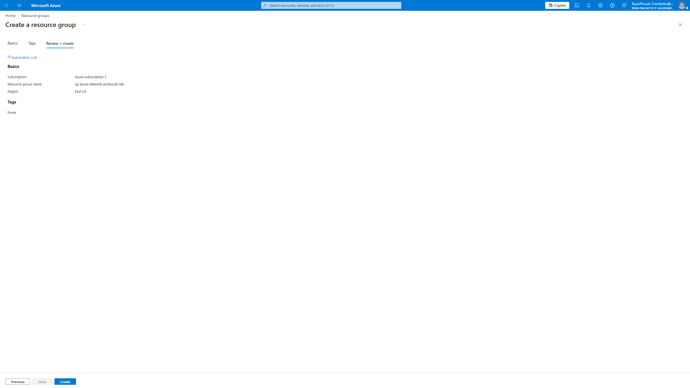

This screenshot shows the Azure resource group configuration before deployment. The resource group is the container used to organize the lab resources for this project, including the virtual machines, virtual network, network security group, and protocol testing environment. For a help desk or junior cloud support role, this demonstrates basic Azure portal navigation, resource organization, and awareness of how cloud infrastructure is grouped before troubleshooting begins.

### 2. Resource Group Overview

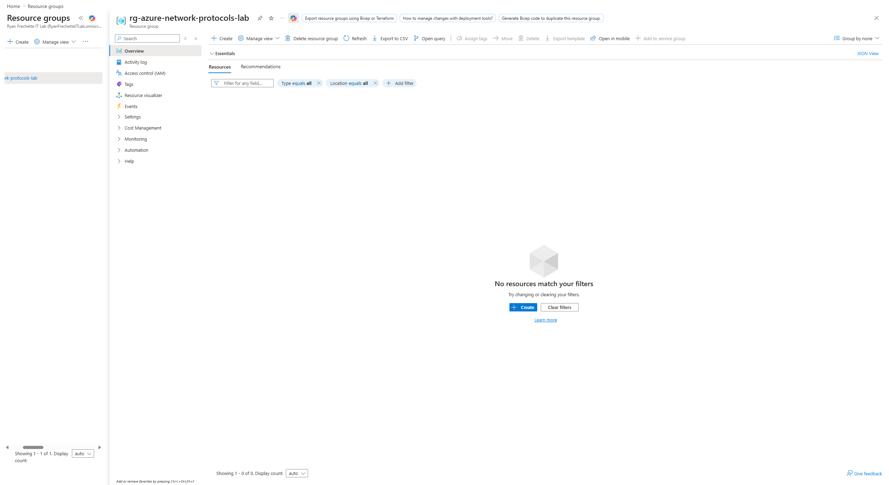

This screenshot shows the completed Azure resource group that will contain the lab environment. In a support role, resource groups help technicians quickly identify which virtual machines, networks, security rules, and services belong to the same system or troubleshooting scenario. This confirms the cloud workspace is ready before deploying the Windows and Linux virtual machines.

### 3. Windows VM Overview

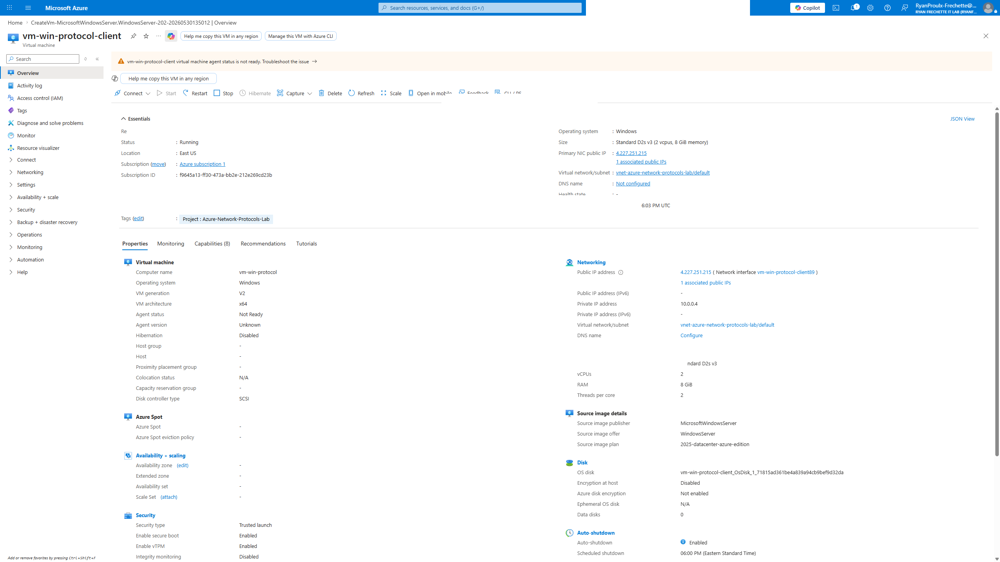

This screenshot shows the Windows virtual machine created for the lab. The VM acts as the support workstation used to test connectivity, run command-line troubleshooting tools, connect over RDP, and later capture protocol traffic with Wireshark. For a help desk or junior cloud support role, this demonstrates basic Azure VM deployment, cost-aware configuration, and safe documentation of cloud resources without exposing sensitive details.

### 4. Linux VM Overview

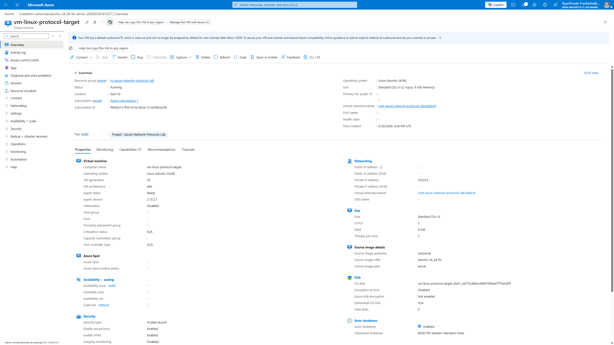

This screenshot shows the Linux virtual machine created as the target system for protocol and connectivity testing. It is placed in the same Azure virtual network as the Windows VM, but it does not expose inbound internet access. For a help desk or junior cloud support role, this demonstrates safer cloud lab design, internal network testing, and the ability to separate a troubleshooting client from a target server.

### 5. ICMP Test: Windows VM to Linux VM

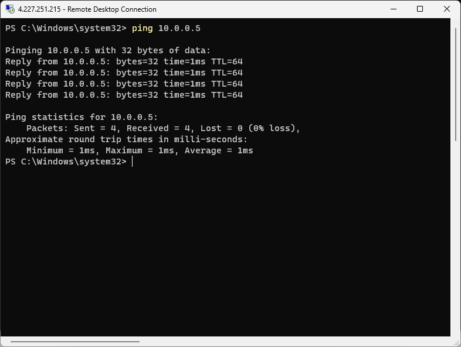

This screenshot shows a successful ping from the Windows VM to the Linux VM using the Linux VM's private IP address. The replies confirm that both virtual machines are on the same Azure virtual network and can communicate internally without exposing the Linux VM directly to the internet. For a help desk or junior cloud support role, this demonstrates basic ICMP testing, private IP troubleshooting, and validation of cloud network connectivity.

### 6. SSH Test: Windows VM to Linux VM

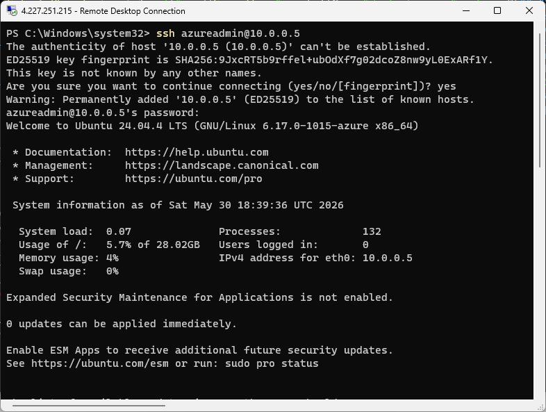

This screenshot shows a successful SSH connection from the Windows VM to the Linux VM using the Linux VM's private IP address. This confirms that the Windows support workstation can securely access the Linux target over the internal Azure virtual network without exposing SSH directly to the public internet. For a help desk or junior cloud support role, this demonstrates private network access, remote administration, SSH troubleshooting, and secure cloud lab design.

### 7. TCP Test: SSH Port 22 Connectivity

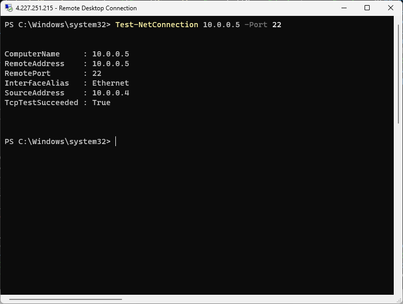

This screenshot shows a successful TCP port test from the Windows VM to the Linux VM on port 22. Unlike a basic ping test, this confirms that the SSH service is reachable over the internal Azure virtual network. For a help desk or junior cloud support role, this demonstrates port-level troubleshooting, service reachability testing, and the difference between general network connectivity and application-specific connectivity.

### 8. RDP Access: Host Computer to Windows VM

This screenshot shows a Remote Desktop session into the Azure Windows VM. RDP access is a common support workflow for remotely inspecting a Windows system, running troubleshooting commands, validating connectivity, and documenting findings. For a help desk or junior cloud support role, this demonstrates remote access familiarity and the ability to work inside a cloud-hosted Windows environment.

### 9. DNS Test: Name Resolution from Windows VM

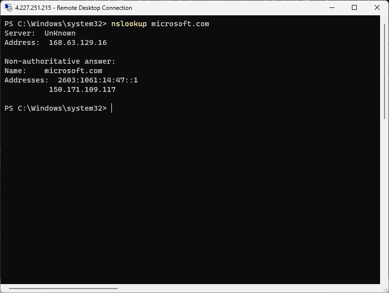

This screenshot shows a DNS lookup from the Windows VM resolving microsoft.com to public IP addresses. DNS testing helps separate name resolution problems from network connectivity problems. For a help desk or junior cloud support role, this demonstrates basic DNS troubleshooting using command-line tools inside a cloud-hosted Windows environment.

### 10. NSG Block Test: ICMP Denied

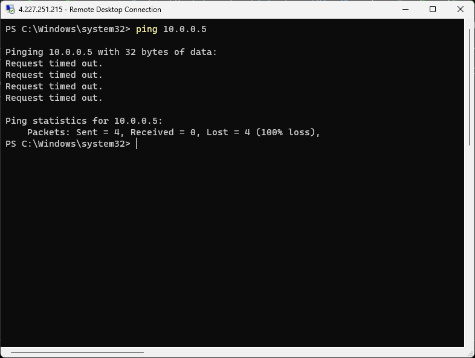

This screenshot shows ping failing after an Azure Network Security Group rule was applied to deny ICMP traffic from the Windows VM to the Linux VM. Earlier screenshots proved the same ping worked before the rule change, so this demonstrates how a cloud firewall rule can block traffic even when both virtual machines are running. For a help desk or junior cloud support role, this shows firewall-based troubleshooting and before/after connectivity validation.

### 11. Wireshark Setup: Ethernet Interface Selected

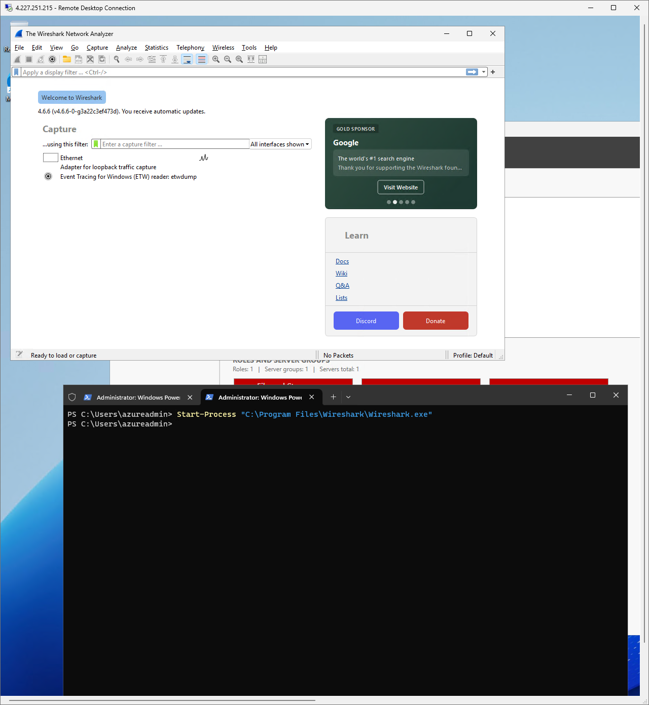

This screenshot shows Wireshark installed on the Azure Windows VM with the Ethernet capture interface available. This confirms the packet-capture tool is ready before running protocol tests. For a help desk or junior cloud support role, this demonstrates the ability to prepare a Windows troubleshooting workstation for network traffic inspection instead of relying only on command-line results.

### 12. Wireshark Capture: ICMP Blocked by NSG

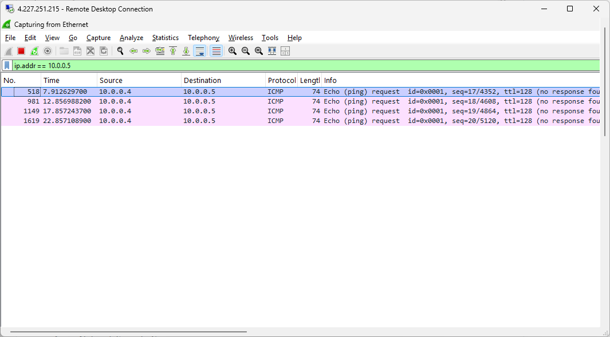

This screenshot shows Wireshark capturing ICMP echo requests from the Windows VM to the Linux VM while the Azure Network Security Group deny rule is active. The capture shows requests going from the Windows private IP to the Linux private IP with no successful replies, matching the failed ping test. For a help desk or junior cloud support role, this demonstrates packet-level troubleshooting and confirms that the connectivity failure is caused by traffic being blocked, not by the command-line tool itself.

### 13. Azure Virtual Network Overview

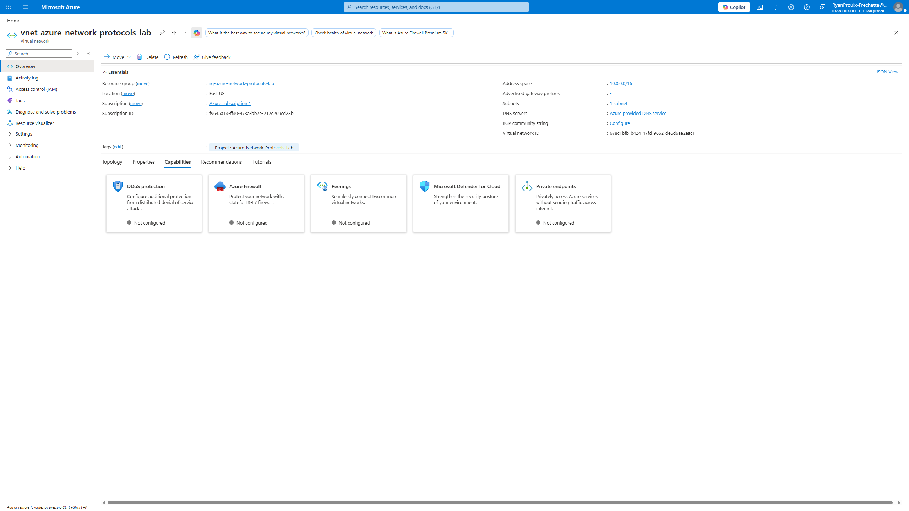

This screenshot shows the Azure virtual network used by the lab. The address space and subnet provide the private network path between the Windows troubleshooting VM and the Linux target VM. For a help desk or junior cloud support role, this demonstrates awareness of where cloud connectivity begins: virtual networks, subnets, DNS settings, and private IP communication.

### 14. NSG Deny Rule Overview

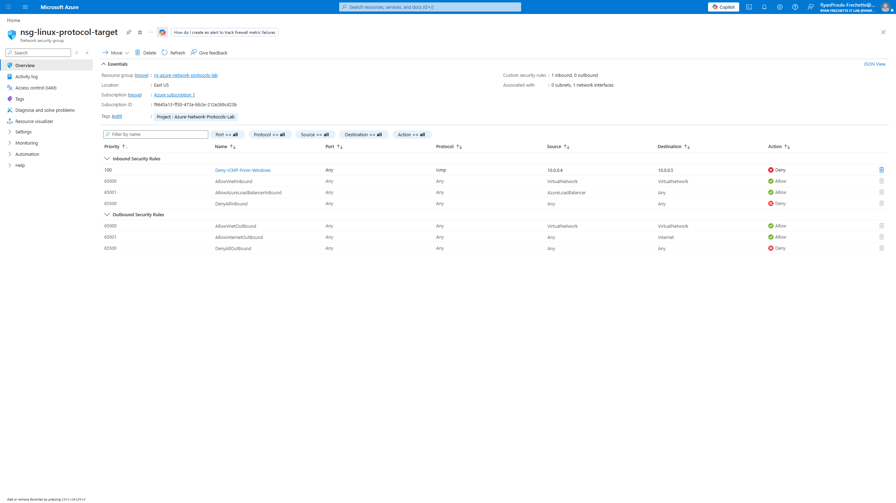

This screenshot shows the Azure Network Security Group rule used to block ICMP traffic from the Windows VM to the Linux VM. The rule denies traffic from the Windows VM private IP to the Linux VM private IP, which explains why ping requests fail after the rule is applied. For a help desk or junior cloud support role, this demonstrates how firewall rules can create connectivity issues even when both virtual machines are online and correctly networked.

### 15. Wireshark Capture: ICMP Allowed Request and Reply

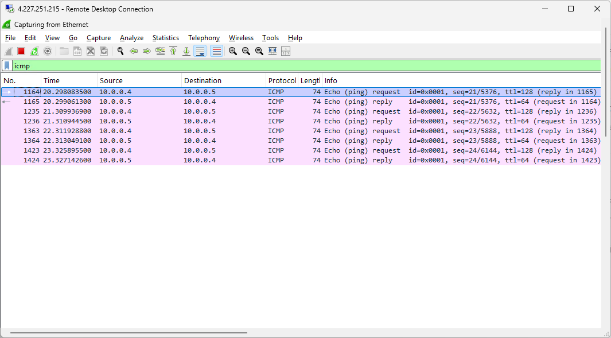

This screenshot shows Wireshark capturing successful ICMP traffic between the Windows VM and Linux VM after the deny rule was removed. The capture shows echo requests from the Windows VM private IP to the Linux VM private IP and echo replies returning from the Linux VM. For a help desk or junior cloud support role, this demonstrates packet-level validation of restored connectivity and shows the difference between blocked traffic and allowed traffic.

### 16. Wireshark Capture: DNS Traffic

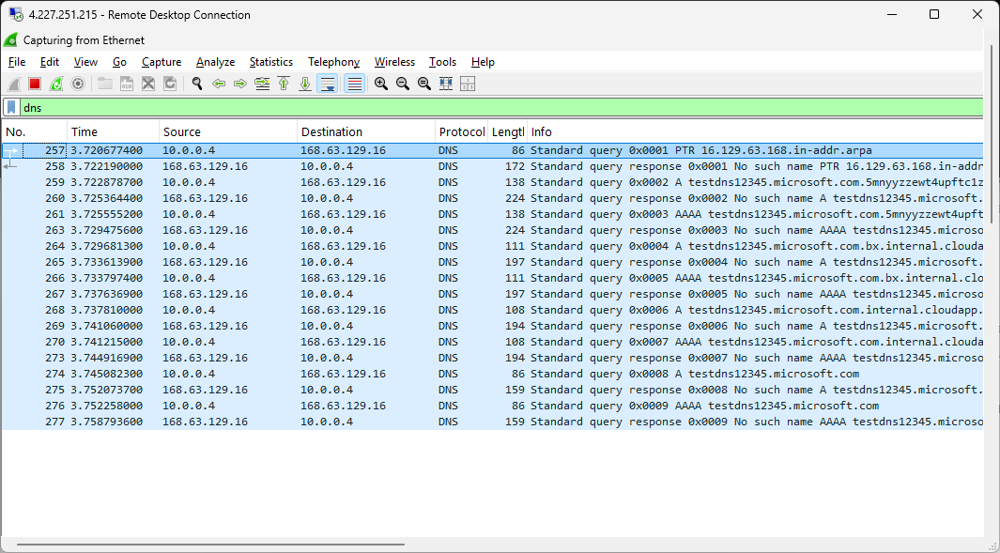

This screenshot shows Wireshark capturing DNS traffic from the Windows VM during a name lookup test. The capture shows DNS queries leaving the Windows VM and responses returning from Azure-provided DNS. For a help desk or junior cloud support role, this demonstrates how DNS troubleshooting can be validated at the packet level instead of relying only on command-line output.

## Tools Used
- Microsoft Azure
- Windows virtual machine
- Linux virtual machine
- Azure Virtual Network
- Azure Network Security Group
- Remote Desktop Protocol
- PowerShell
- Wireshark
- ICMP / ping
- DNS lookup
- SSH

## Interview Talking Points
- Explain how the Windows VM and Linux VM communicated over private IP addresses inside the Azure virtual network.
- Explain how the NSG deny rule caused ping to fail even though both VMs were still online.
- Explain the difference between ping success, TCP port success, and DNS resolution.
- Explain how Wireshark confirmed blocked traffic versus restored request/reply traffic.
- Explain why deleting the resource group matters for cost control and safe lab cleanup.

## Interview Talking Points
- Explain how the Windows VM and Linux VM communicated over private IP addresses inside the Azure virtual network.
- Explain how the NSG deny rule caused ping to fail even though both VMs were still online.
- Explain the difference between ping success, TCP port success, and DNS resolution.
- Explain how Wireshark confirmed blocked traffic versus restored request/reply traffic.
- Explain why deleting the resource group matters for cost control and safe lab cleanup.

## Skills Demonstrated
- Azure portal navigation
- Cloud resource organization
- Screenshot-based technical documentation
- Beginner cloud networking fundamentals
- Support-focused troubleshooting mindset
- Clear written explanations for escalation or ticket notes

## Privacy Note
Screenshots are reviewed before publishing to avoid exposing credentials, secrets, subscription IDs, private keys, or unnecessary personal information.

## Final Notes
This lab is complete and portfolio-ready. The screenshots and command outputs document the full troubleshooting story: Azure setup, private VM connectivity, remote access, DNS testing, NSG blocking, Wireshark packet inspection, restored connectivity, and resource cleanup.

